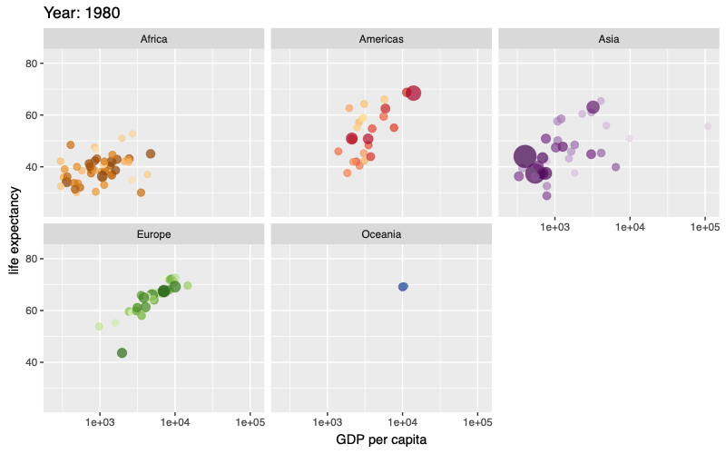
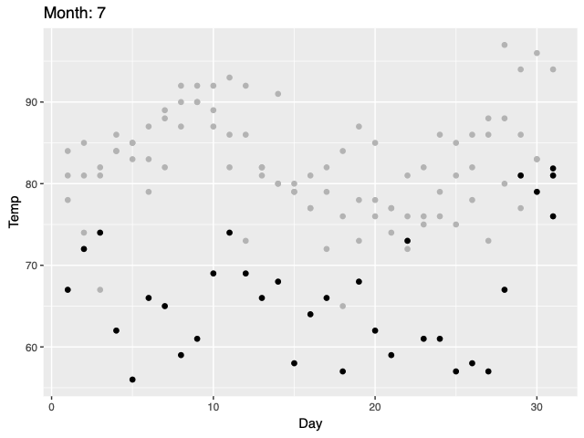

<!-- README.md is generated from README.Rmd. Please edit that file -->

# gganime

<!-- badges: start -->

[](https://github.com/long39ng/gganime/actions/workflows/R-CMD-check.yaml)
[](https://app.codecov.io/gh/long39ng/gganime)

<!-- badges: end -->

`gganime` renders a [ggplot2](https://ggplot2.tidyverse.org) plot
written with [gganimate](https://gganimate.com) syntax as an animated
SVG. The output is a self-contained HTML widget powered by
[Anime.js](https://animejs.com) (through the
[animejs](https://github.com/long39ng/animejs) package), instead of a
GIF or a video.

Because the animation is a single SVG with a timeline over its
attributes:

- it stays sharp at any size, since the marks are vectors rather than a
  raster of fixed pixels;
- the file holds one copy of the scene plus per-element keyframes, not
  one image per frame;
- it plays in the browser with a scrub bar, so a reader can pause and
  step through frames.

## Installation

Install the development version from GitHub with:

``` r
# install.packages("pak")
pak::pak("long39ng/gganime")
```

`gganime` needs [animejs](https://github.com/long39ng/animejs) (\>=
1.1.0).

## Usage

Write the plot exactly as you would with gganimate, then call `anime()`
instead of `animate()`. Here `transition_time()` animates over a
continuous variable, sizing each country’s bubble by population and
filling in the `{frame_time}` label between years:

``` r
library(ggplot2)
library(gapminder)
library(gganime)

p <- ggplot(gapminder, aes(gdpPercap, lifeExp, size = pop, colour = country)) +
  geom_point(alpha = 0.7, show.legend = FALSE) +
  scale_colour_manual(values = country_colors) +
  scale_size(range = c(2, 12)) +
  scale_x_log10() +
  facet_wrap(~continent) +
  labs(title = "Year: {frame_time}", x = "GDP per capita", y = "life expectancy") +
  transition_time(year) +
  ease_aes("linear")

anime(p)
```



A `shadow_mark()` leaves earlier frames behind the current one:

``` r
p <- ggplot(airquality, aes(Day, Temp)) +
  geom_point() +
  transition_time(Month) +
  shadow_mark(colour = "grey70") +
  labs(title = "Month: {frame_time}")

anime(p)
```



`anime()` returns an htmlwidget, so it prints in the RStudio Viewer,
embeds in R Markdown and Quarto, and saves with
`htmlwidgets::saveWidget()`. Loading `gganime` also makes a bare
gganimate plot print through `anime()` at the console; set
`options(gganime.autoprint = FALSE)` to keep gganimate’s own output.

In Shiny, use `gganimeOutput()` and `renderGganime()`.

## Supported features

- Transitions: `transition_states()`, `transition_time()`,
  `transition_reveal()`.
- Geoms: points, lines and paths, bars and columns, areas and ribbons.
- Facets: `facet_wrap()` and `facet_grid()`, with fixed or free scales.
- Coords: `coord_cartesian()`, `coord_fixed()` / `coord_equal()`, and
  `coord_flip()`.
- `enter_*()` / `exit_*()`, `ease_aes()`, and per-frame labels in the
  title, subtitle, and caption.
- `shadow_mark()`.

Anything else stops with a message naming the alternative. Current
limits include non-linear coordinate systems (`coord_polar()`,
`coord_radial()`, `coord_transform()`, `coord_sf()`), `shadow_wake()` /
`shadow_trail()`, and `view_*()` other than `view_static()`.
